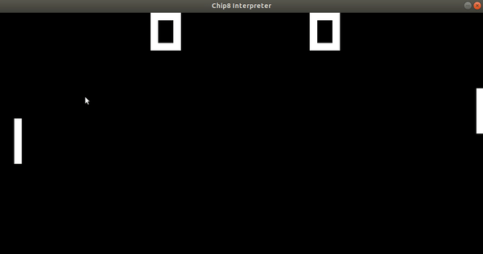

# Chip 8 Emulator

CHIP-8 is an interpreted programming language, developed by Joseph Weisbecker, It consists of operation codes (opcodes) used to instruct a virtual environment used to make simple 8-bit games. This project was made so I could attempt to develop my own chip8 interpreter to learn a bit more about how emulators/interpreters work.



## Getting Started

These instructions will get you a copy of the project up and running on your local machine for development and testing purposes. See deployment for notes on how to deploy the project on a live system.

### Prerequisites

All code was built and run on Ubuntu 18.04

What things you need to install the software and how to install them.

CMake for C++ build management
```
sudo apt-get update
sudo apt-get install cmake
```

SDL2.0 for graphics
```
sudo apt-get update
sudo apt-get install libsdl2-dev
```

googletest (Optional, for unit testing only)
```
sudo apt-get update
sudo apt-get install libgtest-dev
```

Furthermore, you can use setup.sh

### Installing

A step by step process of how to build and run the project, assuming you are starting in the home directory of the project.

```
mkdir build
cd build
cmake ..
make
```

To run the program after making the executable.

```
./main <path_to_rom>
```

Roms can be found in [roms](roms/)

## Running the tests

Unit tests were created using the googletest c++ test framework. Tests were designed to ensure that data is correctly stored
and that opcodes are correctly interpreted. 

To run the unit tests: 

```
cd tests
mkdir build
cd build
cmake ..
make
./tests
```
## Lasting Issues

For future improvement, the last two remaining issues that are not crucial for chip8 operation but for a solid user experience is proper implementation of the delay and sound timer. Until then, the emulator does not have any sound and has slight framerate issues. 

## Built With

* [SDL2.0](https://www.libsdl.org/) - Multimedia hardware abstraction layer for graphics and keyboard input
* [CMake](https://cmake.org/) - C++ build management tool
* [gtest](https://github.com/google/googletest) - Unit testing framework

## Authors

* **Carl Baron** - *Complete Project* - [cbaron3](https://github.com/cbaron3)

## License

This project is licensed under the MIT License - see the [LICENSE.md](LICENSE.md) file for details

## Acknowledgments

* Thanks to Laurence Muller and his tutorial series outlining the chip8 environment http://www.multigesture.net/articles/how-to-write-an-emulator-chip-8-interpreter/
* Thanks to these resources for providing detailed explanation of the chip8 architecture http://www.codeslinger.co.uk/pages/projects/chip8/examples.html and http://devernay.free.fr/hacks/chip8/C8TECH10.HTM
